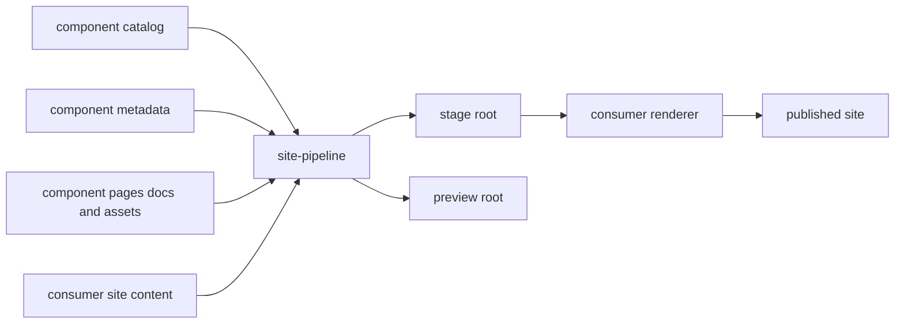

<!--
Copyright 2026 The Apache Software Foundation

Licensed under the Apache License, Version 2.0 (the "License");
you may not use this file except in compliance with the License.
You may obtain a copy of the License at

http://www.apache.org/licenses/LICENSE-2.0

Unless required by applicable law or agreed to in writing, software
distributed under the License is distributed on an "AS IS" BASIS,
WITHOUT WARRANTIES OR CONDITIONS OF ANY KIND, either express or implied.
See the License for the specific language governing permissions and
limitations under the License.
-->

# Site Pipeline overview

Site Pipeline is a staging layer for multi-repository documentation sites. It
reads a consumer-owned component catalog, collects each component's pages,
docs, assets, and metadata, and writes a predictable site contract beneath the
configured stage root.

The pipeline is intentionally separate from the final site renderer. It owns
staging and validation; the consumer owns theming, navigation, publishing, and
environment-specific runtime choices.

## Responsibility split

### Pipeline-owned behavior

- component discovery from a catalog, defaulting to `site/components.yaml`,
- component metadata loading from `site/component.yaml`,
- staging of component pages, versioned docs, and assets,
- generated metadata under the stage root,
- safety checks for path boundaries and protected outputs, and
- `build`, `watch`, `preview`, and `clean` CLI workflows.

### Consumer-owned behavior

- the repository layout used to host the site workspace,
- top-level authored site content, defaulting to `site/content`,
- renderer integration, templates, shortcodes, navigation, and branding, and
- publishing, release, and CI policy.

Consumer-specific helpers are outside the core pipeline contract. For example, a
consumer site may add convenience shortcodes for component pages, but those are
owned by that renderer layer rather than by the staging package.

## Configuration model

The CLI supports command-line overrides plus an optional consumer-owned
configuration file at `site/site-pipeline.yaml`.

Current supported settings include:

- `workspace.catalogPath`, defaulting to `site/components.yaml`,
- `workspace.authoredSiteContentPath`, defaulting to `site/content`,
- `workspace.stagePath`, defaulting to `site/.stage`,
- `workspace.previewPath`, defaulting to `site/.preview`,
- `site.siteTitle`, and
- `site.projectStatus` with allowed values `incubating`, `graduated`, or `retired`.

Precedence is:

1. command-line arguments,
2. `site/site-pipeline.yaml`,
3. pipeline defaults.

`--config`, `--catalog`, `--authored-site-content`, `--stage-path`, and
`--preview-path` are resolved relative to the repo root and rejected if they
escape that boundary. The pipeline also rejects overlapping workspace roots so
authored inputs and generated outputs cannot clobber protected site sources.

## Architecture overview

The pipeline's job ends at the staged contract. A renderer such as Hugo can then
consume staged `content`, `data`, and `static` trees without reading arbitrary
component repositories directly.

## Runtime commands

- `site-pipeline build` stages the current workspace and writes preview output.
- `site-pipeline watch` rebuilds the stage root when relevant inputs change.
- `site-pipeline preview` serves a deliberately barebones preview output. It is
  far away from a real rendered website and exists only as a lightweight
  staging/debug convenience.
- `site-pipeline clean` removes pipeline-managed outputs.

Watch mode intentionally rebuilds the stage root without rewriting the preview
root on every change. That keeps interactive development responsive and avoids
unnecessary file-system churn for downstream renderers.

## Inputs and outputs

### Inputs

- the consumer-owned component catalog,
- optional `site/site-pipeline.yaml` defaults,
- `site/component.yaml` in participating components,
- `site/pages/` for non-versioned component pages,
- `site/docs/` for versioned documentation,
- optional `site/assets/` for static files, and
- consumer-authored site content under the configured authored site root.

### Outputs

At minimum, the stage root contains:

- `content/components/<slug>/_index.md` and additional component pages,
- `content/components/<slug>/development/docs/...`,
- `content/components/<slug>/development/version.yaml`,
- `content/components/<slug>/lifecycle.yaml`,
- `data/components.yaml`,
- `data/lifecycle.yaml`,
- `data/aliases.yaml`,
- `static/components/<slug>/development/assets/...` when assets exist, and
- `manifest.yaml`.

The preview root contains the lightweight Python preview output. The staged tree
remains the single source of truth for derived component, docs, and lifecycle
paths.

## Security and safety baseline

The current implementation keeps these guardrails:

- no arbitrary renderer logic from component repositories,
- no path traversal outside approved workspace roots,
- no overlap between authored inputs and generated outputs,
- no symlink-following while copying docs or assets,
- no component-authored shadowing of reserved pipeline-owned paths such as
  `development/`, `releases/`, and `lifecycle.yaml`, and
- no network fetching during normal builds.

## Read next

- [Site component contract](../site-component-contract/)
- [Adoption guide](../adoption-guide/)
- [Workspace examples](../examples/)

## Current limitations

- route removals can linger briefly in an already-running `make serve`
  session until Hugo is restarted
- release snapshot staging from exact tags is not implemented yet
- redirects, sitemap policy, and publication automation remain future work
