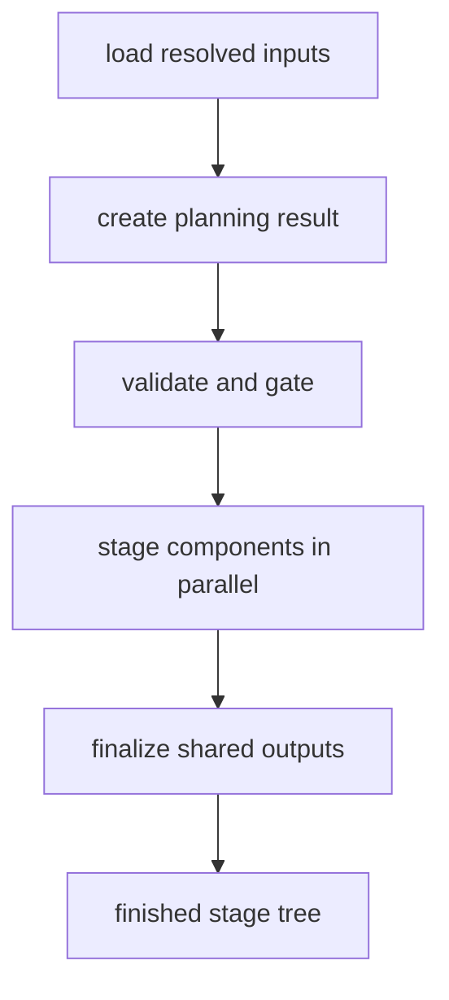
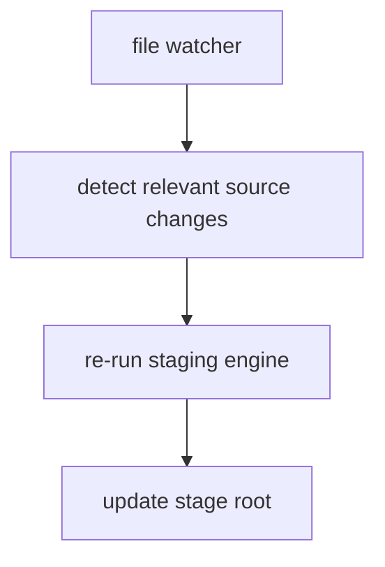

<!--
Copyright 2026 The Apache Software Foundation

Licensed under the Apache License, Version 2.0 (the "License");
you may not use this file except in compliance with the License.
You may obtain a copy of the License at

http://www.apache.org/licenses/LICENSE-2.0

Unless required by applicable law or agreed to in writing, software
distributed under the License is distributed on an "AS IS" BASIS,
WITHOUT WARRANTIES OR CONDITIONS OF ANY KIND, either express or implied.
See the License for the specific language governing permissions and
limitations under the License.
-->

# Recommended staging-engine implementation architecture

This document describes the recommended internal architecture for the staging
engine and watch loop.

For maintainers who need the internal package boundaries, shared execution-path
rules, and watch/publication guardrails that support this architecture, see
[`code-maintenance.md`](code-maintenance.md).

It is intentionally about **implementation structure only**. It does not define
the public CLI, the publication model, the catalog schema, or the staged-output
contract. Those concerns belong in the other current docs.

The examples below use `build()` and `stage_component()` as internal
implementation names for the top-level coordinator and the per-component worker.
Other names are fine as long as the execution split stays clear.

The recommendation is intentionally conservative:

- keep component work isolated and idempotent
- use process-level parallelism for component fan-out
- keep worker internals mostly synchronous
- keep watch mode as an orchestration layer on top of the same staging engine

## Scope of this document

This document covers:

- coordinator vs worker responsibilities
- process and concurrency boundaries
- output ownership rules inside the stage root
- watch-loop structure
- scaling path for the implementation

This document does **not** cover:

- public command naming or CLI guarantees
- schema or model design
- publication, routing, or lifecycle semantics
- the stable staged-output contract

## Architectural split

The staging implementation should be separated into four layers.

1. **Resolve effective build inputs**: load already-defined inputs and create one
   immutable planning result for the current run, plus an immutable build-plan
   candidate when planning prerequisites are sufficient.
2. **Component staging**: stage one component into its owned subtree.
3. **Aggregate and finalize**: write shared outputs derived from worker results
   and top-level plan inputs.
4. **Watch orchestration**: detect relevant changes and re-run the same staging
   engine.

## Shared execution path for `check`, `build`, and `watch`

The implementation should keep one shared execution pipeline for:

- `site-pipeline check`
- `site-pipeline build`
- each rebuild cycle inside `site-pipeline watch`

Recommended phase split:

1. resolve effective inputs and create the immutable planning result, plus the
   build-plan candidate when available
2. run validation and collect diagnostics
3. if staging is enabled, prepare the stage root and execute component and
   aggregate writes
4. emit command-appropriate summaries or machine-readable reports

Command mapping should be:

- `check`: phases 1, 2, and 4 only
- `build`: phases 1 through 4 once
- `watch`: phases 1 through 4 repeatedly after relevant invalidation events

That keeps validation semantics aligned with actual staging behavior instead of
creating a separate "preflight-only" implementation path.

## Top-level coordinator responsibilities

The top-level coordinator should remain the single entry point for one staging
pass. Its job is orchestration, not per-component business logic.

Recommended responsibilities:

- accept the resolved build plan and output locations
- prepare or reset pipeline-owned output areas
- create immutable worker specifications for each component
- dispatch component work
- collect compact worker summaries
- write shared stage-root outputs from the collected results
- stage non-component top-level content included in the build plan
- emit run-level diagnostics or summaries if the implementation keeps them

The coordinator should **not** contain the detailed logic for parsing component
metadata, copying component files, or deriving component-local metadata. That
logic belongs in worker-side functions below `stage_component()`.

If machine-readable run reporting is enabled, the coordinator is also the right
place to assemble the final `StageRunReport` from collected diagnostics,
worker-result summaries, and final manifest location.

## Component worker responsibilities

`stage_component()` should be the unit of isolated staging work.

Recommended properties:

- deterministic for a given input snapshot
- idempotent when re-run on the same inputs
- no writes outside its owned component subtree
- no dependence on mutable global state
- small serializable input spec
- compact serializable result object

Within one component worker, straightforward synchronous code is preferred for:

- metadata loading and validation
- path walking and file copying
- Markdown or page normalization
- component-local derived metadata generation
- mount handling that stays within the worker's owned subtree

This keeps the worker easy to reason about and makes process fan-out the main
source of parallel speedup.

## Parallelism model

For this implementation, the recommended default is:

- **processes** for component or component-version fan-out
- **synchronous worker internals** for local filesystem and parser-heavy work
- **threads only where profiling proves they help**, such as bounded overlap of
  clearly blocking I/O

`asyncio` is not the recommended default here. The workload is dominated by local
filesystem access and synchronous parser libraries, so async I/O would add
coordination complexity without changing the core execution shape.

Worker process boundaries should stay narrow:

- pass paths, slugs, config values, and small metadata in
- let the worker read its own inputs from disk
- let the worker write only its owned subtree
- return only a compact result summary to the parent

Large Markdown bodies, parsed document trees, or asset blobs should not be sent
through process queues.

## Output ownership rules

The parent coordinator should own all writes shared across components.

That includes:

- shared metadata files
- top-level stage-root files
- non-component top-level staged content
- any debug or preview-style output the implementation chooses to generate

Each component worker should own only its own derived subtree beneath the stage
root.

This ownership model avoids write races and keeps failures local to one
component.

The parent should finalize shared outputs only after worker results have been
collected, so one failed worker does not leave a mixed partially-finalized run
looking successful.

For watch-triggered rebuilds, the same safety rule should hold: if a cycle fails
before finalization, the implementation should preserve the last known-good
finalized stage when possible. If the implementation cannot guarantee that the
current stage root remains coherent and trustworthy, it should stop the watch
process instead of continuing on top of a dubious stage state.

## One-off staging pass

For a one-off run, the recommended internal flow is:

1. load the resolved build plan
2. dispatch component workers
3. collect worker results and fail the run if any worker fails
4. write shared outputs from the successful results
5. return a final run summary to the caller

## Where watch mode fits

Watch mode should be a thin orchestration layer, not a separate build system.

It should:

- determine the relevant watch roots from the effective build plan
  - a watch root is a filesystem root derived from a watch-eligible local input
    path represented in the effective plan
  - that includes active top-level site pages, site assets, and vendor asset
    trees when they participate in the current build plan
  - one watch root is not necessarily one component; one component may
    contribute multiple roots and multiple components may share one root
- filter irrelevant file changes
- coalesce bursts of related changes when useful
- trigger the same staging engine used by one-off runs
- restart its watch set when the effective roots change
- refresh any requested machine-readable watch report after each completed cycle

It should not duplicate component staging logic or invent a second execution
pipeline.

The current safe default is full stage regeneration on each relevant change.
Over time, this can evolve toward incremental restaging, but the watch loop
should continue to call into the same staging engine rather than bypassing it.

Ordinary watch-cycle validation or staging failures should not require process
exit if the previous finalized stage remains trustworthy. In that case the watch
loop should keep running, retain the last known-good stage, and update the
machine-readable run report to show a failed cycle without claiming a fresh stage
write.

If the initial watch cycle cannot produce a trustworthy stage and there is no
previous finalized stage to retain, the command should fail before entering
steady-state watch mode.

If the watch implementation cannot guarantee that the current stage root is still
coherent after a failed cycle, it should fail hard and exit. Safety and
correctness are more important than keeping the loop alive on a corrupt stage.

When `watch` reporting is enabled, the implementation must rewrite one JSON
status file at the caller-selected report-output path via same-directory
temporary write plus atomic replace after the initial cycle and after each
subsequent rebuild cycle. The implementation must validate that the report path
stays within the intended owned location and does not resolve through a symlink
at the final write target. That keeps the report easy for external tools to poll
without inventing a separate streaming protocol.

## Recommended evolution path

The safest scaling path is:

1. keep one code path for one-off runs and watch-triggered rebuilds
2. introduce coarse component-level process parallelism
3. preserve deterministic parent-owned aggregation of shared outputs
4. add incremental invalidation only after correctness is well covered
5. later introduce finer-grained version-level work units if component-level work
   becomes too coarse

That sequence lets the implementation scale from today's full-rebuild model
toward larger multi-component and multi-version workspaces without forking the
core execution path.

For the maintainer-facing watch and publication guardrails that should remain
true as the implementation evolves, see
[`code-maintenance.md`](code-maintenance.md).