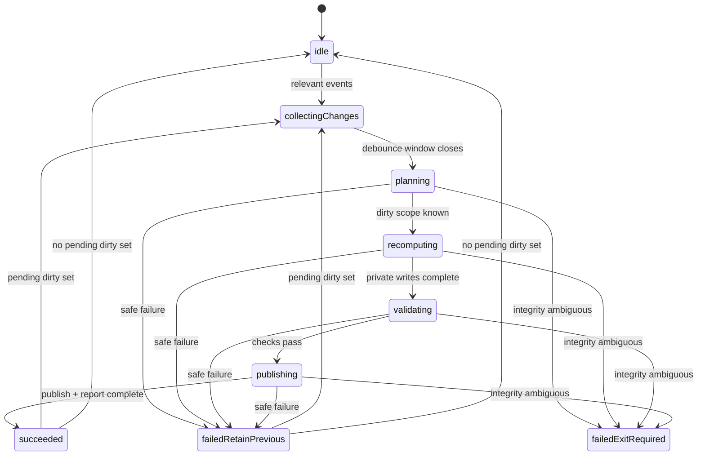

<!--
Copyright 2026 The Apache Software Foundation

Licensed under the Apache License, Version 2.0 (the "License");
you may not use this file except in compliance with the License.
You may obtain a copy of the License at

http://www.apache.org/licenses/LICENSE-2.0

Unless required by applicable law or agreed to in writing, software
distributed under the License is distributed on an "AS IS" BASIS,
WITHOUT WARRANTIES OR CONDITIONS OF ANY KIND, either express or implied.
See the License for the specific language governing permissions and
limitations under the License.
-->

# Watch and incremental staging guardrails and implementation plan

This document records the recommended guardrails and phased implementation plan
for `site-pipeline watch` and future incremental staging.

It complements:

- `planning-and-input-resolution-implementation-guide.md` for watch-target input
  planning and watch-root derivation
- `evaluation-and-validation-implementation-guide.md` for per-cycle contextual
  validation and stage-gating behavior
- `build-architecture.md` for coordinator/worker structure and concurrency
- `stage-build-implementation-guide.md` for runtime types, worker boundaries, and
  private stage assembly rules
- `staged-output-contract.md` for finalized output integrity rules
- `source-resolution-and-materialization.md` for watch-target planning inputs
- `security-and-trust-model.md` for path-safety and trust-boundary rules

This document is intentionally about implementation planning. It does not widen
the public CLI or staged-output contract.

## Why this document exists

`watch` is where correctness and operator trust are easiest to lose.

The main failure modes to avoid are:

- falling back to ad hoc full rebuilds into a renderer-visible tree,
- exposing partially updated content or aggregates,
- treating raw filesystem events as a complete truth source,
- letting watch mode invent its own execution path separate from `build`, and
- creating renderer instability, including Hugo crashes, during change bursts.

The first goal is therefore not the smallest possible update. The first goal is
to keep the visible stage coherent and renderer-safe while still moving toward
incremental recomputation over time.

## Non-goals

This plan does not require the first implementation wave to provide:

- file-level minimal patching of the visible stage,
- page-level incremental recomputation,
- renderer-specific behavior inside the core pipeline,
- a new public watch-specific API surface, or
- unsafe in-place mutation as a performance shortcut.

## Terms used below

- **visible stage**: the finalized stage root currently consumed by a renderer or
  other downstream tool.
- **cycle work area**: a private per-cycle directory tree used to prepare a
  rebuild before publication.
- **owned unit**: one staging unit with clear output ownership, such as a
  component subtree, a top-level site subtree, or one aggregate dataset.
- **aggregate output**: shared stage-root output derived from worker results or
  top-level inputs, such as routes, redirects, indexes, diagnostics, or
  `manifest.json`.
- **last-known-good stage**: the most recent visible stage that is known to be
  complete and internally coherent.
- **dirty set**: the normalized set of changed planned inputs that a watch cycle
  will evaluate.

## Core design principle

Treat incremental watch behavior as **incremental recomputation**, not
incremental publication.

That means the implementation should prefer to:

1. detect which planned inputs became dirty,
2. broaden that scope conservatively when unsure,
3. recompute affected owned units privately,
4. recompute dependent aggregates privately, and only then
5. publish a consistent next state.

The visible stage must never become a scratchpad for work in progress.

## Hard invariants

The implementation should treat the following as non-negotiable:

1. The visible stage is always either the previous finalized state or the next
   finalized state, never a partially assembled hybrid.
2. Workers never write directly into the visible stage.
3. Shared aggregates are written only by the coordinator.
4. `watch` uses the same resolve/validate/stage pipeline as one-off `build`.
5. Invalidation scope is derived from planned inputs, not from an unrelated
   second watch model.
6. Every output path has exactly one owner.
7. Failed watch cycles must preserve the last-known-good stage.
8. `manifest.json` remains the commit point for a finalized stage update.
9. Uncertain invalidation scope must broaden rather than guess narrower.
10. Publication and report finalization must happen on the same filesystem as
    the target paths so same-directory atomic replace remains available.
11. Notification mode and polling mode must satisfy the same correctness tests.
12. A cycle may optimize recomputation, but it must never optimize away output
    integrity.
13. Immediately before any visible publication step, the coordinator must
    revalidate path normalization, output ownership, same-filesystem assumptions,
    and final-target non-symlink requirements.
14. Security-sensitive metadata edits must trigger the same validation rules as a
    fresh clean build for redirects, canonical URLs, origins, trust classes,
    mounted content, and other URL-bearing or trust-bearing fields.
15. Unreadable, permission-denied, malformed, oversized, missing, stale, or
    unresolved inputs must never lead to partial publication of a new stage.
16. Local operator override of safe operational defaults must stay outside
    repo-authored and provider-authored inputs.
17. The watcher must ignore pipeline-owned work areas, finalized stage outputs,
    and watch/report outputs so self-generated writes cannot retrigger the next
    cycle as if they were fresh authored input.

## Publication model and intermediate directories

Yes: watch mode should use a private intermediate work area.

At minimum, the implementation should maintain:

- one renderer-visible finalized stage root,
- one pipeline-owned watch work root,
- one per-cycle private work directory beneath that work root, and
- one retained record of the last-known-good cycle outcome.

Recommended structure:

- `stage/` or another caller-selected finalized stage root for renderer-facing
  output,
- a pipeline-owned work area such as `.site-pipeline/watch/`, and
- per-cycle directories such as `.site-pipeline/watch/cycle-000123/`.

Important operational rule: the cycle work area, same-directory temporary files,
and the finalized stage root should live on the same filesystem whenever atomic
replace or rename behavior is part of the publication path. In particular, the
implementation should not finalize visible-stage files out of container-only
paths such as `/tmp` when the stage root is a bind mount on another filesystem.

### Recommended publication strategy

The preferred long-term direction is a generation-style publication model where
the next consistent stage is assembled privately and then handed off in one
controlled publication step.

For the first implementation wave, a more practical compromise is acceptable:

- rebuild affected owned units privately,
- rebuild all dependent aggregates privately,
- publish those outputs serially under coordinator control, and
- write `manifest.json` last.

However, that compromise is acceptable only if tests demonstrate that renderers
never observe an internally inconsistent stage during publication. If that
cannot be guaranteed, implementation should fall back to a broader private stage
generation handoff rather than mutate the visible tree in place.

### Finalization-time revalidation checklist

The coordinator should treat publication as a distinct security-sensitive phase.

Immediately before any visible publication step, it should re-check at least:

1. every target path is still within the owned finalized output root,
2. no target's final write path resolves through a symlink,
3. the target filesystem still permits same-directory atomic replace,
4. the output path is still owned by the unit or aggregate attempting to publish,
5. the aggregate dependency set for the current cycle is complete,
6. any redirect, canonical URL, origin, or mount metadata affected by the cycle
   still passes current validation rules, and
7. the files referenced by the new `manifest.json` all exist and are finalized.

If any of those checks fail, the cycle should fail before visible publication
and retain the last-known-good stage.

## Concurrency and parallelism model

The concurrency plan should follow `build-architecture.md` closely.

### Coordinator responsibilities

One coordinator process owns:

- event ingestion,
- burst coalescing,
- mapping changed paths to planned inputs,
- invalidation-scope calculation,
- worker scheduling,
- aggregate scheduling,
- publication/finalization,
- watch report emission, and
- retention of last-known-good state.

### Worker responsibilities

Use coarse worker processes for owned-unit recomputation such as:

- component subtree staging,
- top-level site pages staging,
- top-level site assets staging, and
- other future owned units that stay output-isolated.

Worker internals should stay mostly synchronous. The default architecture should
not depend on `asyncio`.

### Threads

Threads should be introduced only if profiling proves a benefit for clearly
blocking I/O. They should not be the default correctness mechanism.

### Publication

Publication is serialized. Even when owned-unit recomputation runs in parallel,
only the coordinator may publish visible outputs.

### Cycle overlap

There must never be two concurrent watch publication cycles for the same stage
root. While one cycle runs, new changes accumulate into a pending dirty set for
the next cycle.

## Event ingestion and changed-file bursts

Raw filesystem events are hints, not the ground truth.

The watch loop should:

1. normalize all changed paths,
2. deduplicate duplicate or noisy directory-level events,
3. map them to planned inputs and owned units,
4. coalesce bursts into one dirty generation,
5. run at most one publication cycle at a time, and
6. immediately queue one more cycle if changes arrived during the current one.

The implementation should treat burst handling as a first-class requirement.
Editors, generators, archive extraction, Git checkouts, and provider snapshot
refreshes often produce rename, delete, and rewrite storms rather than one neat
event per logical change.

Recommended conservative rules:

- directory-level changes broaden invalidation when per-file meaning is unclear,
- rename or delete events broaden invalidation beyond the one path when needed,
- repeated writes during a debounce window should collapse into one cycle, and
- a cycle should be allowed to rescan watched roots or affected planned inputs
  before publication if the raw event set is too noisy to trust directly.

The watch root set and event filter should explicitly exclude:

- the pipeline-owned watch work area,
- the finalized stage root,
- same-directory publication temp files,
- watch report output paths, and
- any other pipeline-owned transient output location.

If the stage root or report outputs live beneath a broader watched workspace
tree, the filter must still exclude those subpaths to avoid self-trigger loops.

## Watch-cycle state machine

The coordinator should use one explicit state machine rather than ad hoc nested
conditionals.

Recommended minimum states are:

- `idle`: no pending work and no active cycle
- `collectingChanges`: watcher events are being normalized and coalesced
- `planning`: the coordinator is refreshing planning facts, dirty units, and
  security-sensitive invalidation scope
- `recomputing`: workers or coordinator-owned staging logic are writing only into
  private cycle work areas
- `validating`: aggregate completeness, security-sensitive metadata rules, and
  publication preconditions are checked
- `publishing`: the coordinator is performing serialized visible publication
- `succeeded`: the new cycle became the last-known-good state
- `failedRetainPrevious`: the cycle failed but the previous finalized stage
  remains trustworthy
- `failedExitRequired`: the cycle failed in a way that leaves no trustworthy
  visible stage or makes integrity impossible to guarantee

Recommended transitions are:

- `idle -> collectingChanges` when one or more relevant events arrive
- `collectingChanges -> planning` once the current debounce window closes
- `planning -> recomputing` once dirty scope and watch roots are known
- `recomputing -> validating` after all private writes finish
- `validating -> publishing` only if all invariants and security checks pass
- `publishing -> succeeded` after visible publication and report emission finish
- `planning|recomputing|validating|publishing -> failedRetainPrevious` when the
  cycle fails but the previous finalized stage remains trustworthy
- `planning|recomputing|validating|publishing -> failedExitRequired` when no
  trustworthy stage can remain visible or publication integrity is uncertain
- `succeeded|failedRetainPrevious -> collectingChanges` when pending changes were
  accumulated during the previous cycle
- `succeeded|failedRetainPrevious -> idle` when there is no pending dirty set

The implementation should not skip the explicit `validating` phase. That is the
phase where the coordinator decides whether the private cycle result is safe to
publish at all.

### State diagram

### Recommended coordinator algorithm per cycle

For a first implementation, the coordinator should follow a simple fixed order:

1. collect and coalesce events while ignoring pipeline-owned outputs,
2. refresh planning facts for affected inputs,
3. decide dirty owned units and broadening scope,
4. recompute owned units privately,
5. recompute dependent aggregates privately,
6. validate aggregate completeness and security-sensitive rules,
7. revalidate publication preconditions immediately before visible writes,
8. publish serially under coordinator control,
9. write `manifest.json` last,
10. update the watch report, then
11. either return to `idle` or immediately start the next cycle if pending
    changes were accumulated.

The implementation should resist introducing shortcut branches that bypass that
order. That is how watch mode tends to drift away from the safe one-off build
model.

### Failure outcome rules

The distinction between `failedRetainPrevious` and `failedExitRequired` should be
explicit, because a junior implementation can otherwise make unsafe choices.

Use `failedRetainPrevious` when all of the following are true:

- the previously visible stage was known-good before the cycle started,
- the current cycle failure happened before any untrusted visible mutation, or
  the coordinator can prove the visible stage is still byte-equivalent to the
  prior known-good state,
- the coordinator can still read and report against the current stage root, and
- the failure affects only the attempted next state, not the integrity of the
  already visible state.

Use `failedExitRequired` when any of the following are true:

- the initial watch cycle fails before any trustworthy stage has ever been
  published,
- the coordinator cannot prove the visible stage still matches the prior
  last-known-good state,
- publication preconditions fail after visible mutation has begun and the
  coordinator cannot prove rollback success,
- the finalized stage root or report destination becomes unreadable or otherwise
  untrustworthy,
- same-filesystem finalization guarantees disappear during publication, or
- integrity-critical metadata cannot be validated and the resulting visible stage
  trust level is ambiguous.

When in doubt, prefer `failedExitRequired` over continuing with an ambiguous
stage.

## Invalidation model

Incremental recomputation needs an explicit ownership and dependency model.

Before implementing watch updates, define:

- the list of owned staging units,
- the output paths each unit owns,
- the aggregate datasets each unit feeds, and
- the metadata changes that require broad or global invalidation.

### Change classes and recommended minimum scope

| Change class | Typical examples | Minimum recomputation scope | Required dependent work |
| --- | --- | --- | --- |
| Content file changes | markdown/body/front matter beneath one owned content root | owning content unit | routes, content index, diagnostics, and any page-derived aggregates touched by that unit |
| Content deletion or rename | page removal, slug rename, path move | owning content unit, plus conservative route cleanup | redirects/routes cleanup, content index cleanup, diagnostics |
| Static asset changes | top-level site assets, component assets, vendor asset trees | owning asset unit | manifest references, diagnostics, any asset inventory if later added |
| Component metadata changes | component title, docs roots, artifact metadata, publication selection | whole owning component unit | component aggregates, routes, redirects, content index, diagnostics |
| Site-level metadata changes | site pages root, site assets root, top-level redirects, publication origins | all affected top-level units, often broad rebuild | routes, redirects, canonical URLs, content index, diagnostics |
| Provider snapshot changes | releases, candidates, lifecycle facts, provider URLs | all affected component/artifact units | release aggregates, routes, redirects, indexes, diagnostics |
| Publication or routing changes | locale route mode, origin config, canonical rules | usually broad or full-stage invalidation | routes, redirects, canonical URL fields, manifests, diagnostics |
| Trust and mount changes | `trustClass`, imported subtree mount config, path roots | conservative broad rebuild of affected mounted unit or full stage | diagnostics, mount metadata, any outputs derived from mounted content |
| Component or source addition/removal | new component discovered, component deleted, source root added, source root removed, unit enabled/disabled | refresh plan, refresh ownership map, restart watch roots, broad rebuild of affected ownership domains | cleanup of previously owned outputs, route/redirect/index recomputation, diagnostics, watch-root recomputation |
| Planning-state transition | previously `present` input becomes `missing`, `stale`, or `unresolved`, or later recovers to `present` | re-run planning and validation for the affected input and any dependent units | report update, diagnostics, possible broad invalidation, possible watch-root restart |
| Security-sensitive filesystem transition | symlink created/replaced/removed, file becomes directory, permission denied, unreadable root, mount target changes | conservative broad revalidation of affected unit or full cycle failure | diagnostics, trust revalidation, possible hard stop before publication |
| Malformed or oversized metadata input | malformed config/front matter/provider snapshot, metadata exceeds security ceilings or safe defaults | fail affected cycle before publication; optionally broaden only to compute diagnostics | diagnostics, retained last-known-good stage, possible exit if integrity cannot be guaranteed |
| Watch-root topology changes | a changed plan now points at different roots | restart watch root set and re-run staging | watch root recomputation, report update |

When uncertainty remains, broaden to a larger unit or even a full private
rebuild. Do not guess a smaller scope than the dependency model can justify.

### Add/remove and topology scenarios that must be modeled explicitly

The implementation should not treat add/remove events as just another ordinary
file modification. At minimum it should model:

- a new component appearing in the workspace,
- an existing component being removed,
- a component or artifact becoming newly included or newly excluded by metadata,
- a new site pages or site assets root being declared,
- a previously declared top-level site root being removed,
- a new vendor asset root appearing,
- a mounted subtree being added, removed, or moved, and
- a watch-target planning refresh that changes which local roots are
  `watchEligible: true`.

For those scenarios the default should be:

1. refresh the plan,
2. refresh the ownership map,
3. refresh the watcher root set if needed,
4. compute cleanup of outputs previously owned by removed units,
5. recompute affected aggregates, and
6. publish only after the cleanup and recomputation result is coherent.

If the implementation cannot prove that output cleanup is complete, it should
broaden to a larger private rebuild rather than leave stale outputs in place.

## Planning-state transitions during watch

The planning states `present`, `missing`, `stale`, and `unresolved` are not only
startup concerns. They can change during watch and need explicit rules.

Recommended behavior is:

- `present -> missing`
  - fail the current cycle before publication of any new stage that depends on
    the missing input,
  - keep the last-known-good stage if it remains trustworthy,
  - emit diagnostics and refresh the watch report,
  - re-run planning before the next cycle.
- `present -> stale`
  - treat as a validation failure for any new publication that depends on the
    stale input,
  - keep the last-known-good stage,
  - emit diagnostics and require refreshed local materialization before a new
    stage may be published.
- `present -> unresolved`
  - treat as a planning failure for the affected scope,
  - broaden invalidation only to the extent needed to compute diagnostics,
  - do not publish a new stage that claims success for the unresolved scope.
- `missing|stale|unresolved -> present`
  - re-run planning and validation,
  - recompute affected owned units and dependent aggregates,
  - publish only after the restored input yields a coherent finalized stage.

If a watch cycle discovers that the current watcher root set no longer matches
the new plan, it should update the watcher configuration only after the planning
refresh is complete and the coordinator knows which roots are authoritative.

## Metadata changes deserve first-class treatment

The implementation should not focus only on content-body edits.

Tests and invalidation rules must cover at least:

- content front matter changes,
- component configuration changes,
- artifact and lifecycle metadata changes,
- provider snapshot refreshes,
- route, redirect, and canonical metadata changes,
- locale routing and publication-origin changes,
- mount and trust-class changes, and
- deletions and renames involving metadata-owning files.

If these are not covered early, watch mode will appear correct for plain content
edits while still producing broken routes, stale indexes, or stale publication
metadata.

## Watch-specific security requirements

This document inherits the baseline rules from
`security-and-trust-model.md`, but watch mode needs a more concrete operational
translation of them.

### Security-sensitive change classes

The implementation should treat at least the following as security-sensitive and
never as cheap metadata-only edits:

- path-bearing input changes,
- symlink creation, replacement, or removal,
- trust-class changes,
- mounted-content root changes,
- redirect target changes,
- canonical URL or publication-origin changes,
- provider snapshot changes that alter public URLs or mounted metadata, and
- permission or readability changes affecting watched inputs or output targets.

Those changes must force conservative revalidation before publication.

### Required revalidation rules per cycle

For every cycle, and again immediately before publication, the coordinator should
re-check:

1. path normalization stays within declared input and output roots,
2. symlink resolution still leads to allowed locations,
3. output targets do not resolve through symlinks,
4. redirect targets still resolve to known routes when they are internal,
5. redirect and canonical URL schemes remain allowed and never fall back to
   banned schemes such as `javascript:` or `data:`,
6. external redirect destinations remain allowed only by local
   operator-controlled policy,
7. trust-class and mount declarations still match the resulting staged content,
8. security ceilings and safe defaults are still respected, and
9. no machine-local filesystem details leak into public aggregate outputs.

### Malformed, oversized, and unreadable inputs

Watch mode should treat malformed, oversized, or unreadable inputs as ordinary
but safety-critical validation failures, not as special cases that justify a
best-effort partial stage.

That means:

- malformed configuration or metadata fails the current cycle,
- oversized mounted metadata fails the current cycle under the documented hard
  ceiling,
- oversized diagnostic `details` must use the documented
  `ReducedDiagnosticDetailsSummary` behavior rather than dropping the whole
  diagnostic entry,
- oversized provider snapshots or route inventories over safe operational
  defaults must fail clearly unless a local operator override intentionally
  raised the default, and
- permission-denied or unreadable watched roots must fail safely with retained
  last-known-good state when possible.

The same rule applies to watched-directory scope defaults. If watch startup or a
later watch-root refresh would exceed the documented default limits for watch
roots or watched filesystem entries, the implementation should fail clearly
unless local operator policy intentionally raised those defaults.

If the coordinator cannot tell whether the visible stage remains trustworthy
after one of those failures, it should exit rather than continue on ambiguous
integrity.

## Containerized and macOS-hosted usage

Containerized usage should be treated as a primary operating mode, not a corner
case. macOS-hosted development deserves explicit planning because Linux
containers on macOS bind mounts often behave differently from native Linux
filesystems.

### Watch backend expectations

The implementation should assume that bind-mounted workspaces may produce:

- duplicated events,
- delayed events,
- coalesced directory-level events,
- missing fine-grained notification details, or
- notification behavior that is worse than native Linux inotify.

Because of that, polling must be treated as a supported correctness mode rather
than as a debugging afterthought.

`watchfiles` already documents polling support through `force_polling`,
`WATCHFILES_FORCE_POLLING`, and `WATCHFILES_POLL_DELAY_MS`. The core pipeline
does not need to standardize a new public CLI flag for those knobs immediately,
but the implementation should preserve a clean local-operator path to enable
polling and tune poll delay where notification mode is unreliable.

### Filesystem assumptions to avoid

The implementation should not assume:

- stable inode semantics across host/container boundaries,
- high-resolution mtimes as the sole correctness signal,
- case-sensitive path behavior in all developer workspaces, or
- that a host rename burst will appear as one tidy in-container event sequence.

### Additional macOS-specific guardrails

The implementation should validate and reject path or route collisions that only
differ by case. This should be enforced independent of the current host so that
repositories remain portable between Linux CI and default macOS filesystems.

The implementation should also keep same-directory temporary writes inside the
bind-mounted target tree rather than in a separate container-local filesystem.
Otherwise cross-device rename behavior may break the publication guarantees.

## Test strategy and acceptance philosophy

The main oracle for incremental correctness should be: **the finalized result of
an incremental watch cycle is equivalent to a fresh clean build from the same
workspace state**, modulo obviously variable fields such as timestamps.

That means most success criteria below should be tested as:

1. prepare a workspace fixture,
2. produce a baseline finalized stage,
3. apply one or more changes,
4. let watch process them,
5. produce a separate clean build from the same final workspace state, and
6. compare the normalized stage outputs and reports.

### Recommended test harness pieces

- deterministic workspace fixtures with multiple components and top-level site
  content,
- fake watcher input for unit-testing burst handling and noisy event sequences,
- a synthetic renderer probe that scans the visible stage during publication and
  fails if it ever sees manifest references to missing files or mismatched
  aggregate state,
- fixtures where stage outputs and report outputs live beneath a broader watched
  workspace path so self-trigger filtering is exercised,
- fixtures that cover component addition/removal and top-level root changes,
- fixtures that inject malformed metadata, oversized metadata, and unreadable
  inputs,
- fixtures that exercise symlink replacement and case-collision rejection,
- force-polling integration tests using `WATCHFILES_FORCE_POLLING=1`, and
- parallel worker tests that compare pool size `1` against a larger pool.

An optional later hardening layer is a real Hugo smoke test. The core design
should not depend on Hugo-specific behavior, but a renderer smoke test is a good
way to catch stage-coherency regressions that the synthetic probe did not model.

## Worked implementation examples

The examples below are intentionally concrete so a junior engineer can map the
guardrails to actual control flow.

### Example 1: one page rename plus front matter edit

1. the watcher reports one delete and one add beneath the same owned content
   root,
2. the coordinator coalesces them into one dirty generation,
3. the coordinator maps both events to one owned content unit,
4. the unit is recomputed privately,
5. dependent routes, redirects, and content-index entries are recomputed
   privately,
6. validation confirms the new route set is coherent and no stale entry remains,
7. publication replaces the affected outputs and writes `manifest.json` last.

### Example 2: a component is removed from the workspace

1. the watcher reports deletion of the component root or metadata that makes the
   component disappear from the effective plan,
2. the coordinator re-runs planning,
3. the refreshed plan shows the component is no longer present,
4. the ownership map identifies all previously published outputs owned by that
   component,
5. cleanup is prepared privately together with recomputed aggregates,
6. publication removes the old owned outputs, refreshes aggregates, and writes
   `manifest.json` last.

If cleanup ownership is ambiguous, the coordinator broadens to a larger rebuild
or fails the cycle rather than leaving stale component outputs behind.

### Example 3: provider snapshot refresh exceeds a safe default

1. the watcher or external trigger causes the implementation to reevaluate a
   provider snapshot input,
2. validation finds the snapshot exceeds a safe operational default,
3. the cycle emits a clear diagnostic with measured versus allowed values,
4. no new stage is published,
5. the last-known-good stage remains visible,
6. the watch report records cycle failure without claiming a fresh stage.

### Example 4: redirect metadata changes to an unsafe URL

1. a metadata edit changes a redirect target,
2. the coordinator treats the change as security-sensitive,
3. validation rejects the redirect if it uses an unsupported scheme such as
   `javascript:` or `data:` or if an internal target no longer resolves to a
   known internal route,
4. the cycle fails before publication,
5. the last-known-good stage stays active.

### Example 5: symlink swap inside a watched input root

1. a watched path is replaced by a symlink,
2. the coordinator treats that as a trust-sensitive filesystem transition,
3. path normalization and symlink resolution are re-run for the affected scope,
4. if the final resolved path escapes its declared root or changes trust
   assumptions, the cycle fails safely,
5. no visible publication happens until the path is valid again.

### Example 6: containerized polling on macOS with a noisy burst

1. several save operations, renames, and directory events arrive through a bind
   mount while polling mode is enabled,
2. the coordinator deduplicates and coalesces them,
3. one cycle recomputes the affected units privately,
4. a second dirty set is accumulated if more changes arrive during the first
   cycle,
5. publication remains serialized,
6. the visible stage is always either the previous finalized state or the next
   finalized state.

## Phased implementation plan

### Phase 0: invariants, ownership, and internal model

### Goal

Define the internal model that makes safe watch behavior possible.

### Work items

1. Define owned staging units and their output ownership.
2. Define aggregate dependency inputs.
3. Define internal watch-cycle state objects and outcomes.
4. Define the cycle work-area layout and same-filesystem checks.
5. Define conservative invalidation broadening rules.

### Recommended step order

1. Write down the owned-unit catalog first.
   - Start with the coarse units that are already visible in the current docs:
     top-level site pages, top-level site assets, vendor assets, component-owned
     content subtrees, and coordinator-owned aggregate datasets.
   - Record who owns deletion of previously published paths for each unit.
2. Define the output-ownership map.
   - For each owned unit, record the finalized paths it may create, replace, or
     remove.
   - For shared files, assign the coordinator as the sole owner.
3. Define the aggregate dependency map.
   - For each aggregate dataset, list which owned units can change it.
   - Call out high-blast-radius metadata changes that force broad invalidation.
4. Define the watch-cycle state machine.
   - Minimum states should cover idle, collecting changes, planning,
     recomputing, validating, publishing, succeeded,
     failed-with-last-known-good-retained, and failed-exit-required.
   - Define the handoff between one running cycle and one pending dirty set.
5. Define publication preconditions.
   - Publication must refuse to proceed when output ownership is ambiguous,
     same-filesystem guarantees are missing, or the aggregate dependency set is
     incomplete for the current dirty set.
6. Define normalization and portability rules before watch logic exists.
   - Normalize paths before invalidation decisions.
   - Reject case-only collisions and any publication plan that would differ only
     by case on case-insensitive filesystems.

### Milestone checkpoints

- one written ownership table exists for all first-wave owned units,
- one written aggregate dependency table exists for all first-wave aggregates,
- one internal state diagram or equivalent transition table exists for the watch
  cycle coordinator, and
- the project has agreed stop rules for broadening invalidation versus failing a
  cycle.

### Embedded test design

Tests for this phase should be mostly unit-level and model-level.

Recommended minimum cases:

- ownership tests that prove every finalized path has exactly one owner,
- collision tests for overlapping site-level and component-level publication
  targets,
- path-normalization tests for traversal attempts, symlinked targets, and
  same-directory temporary write planning,
- case-collision tests covering page paths, asset paths, and route outputs, and
- dependency-map tests proving that a change in each first-wave owned unit marks
  the expected aggregates dirty,
- state-machine tests covering success, retained-failure, and exit-required
  transitions, and
- add/remove topology tests for component and top-level root appearance and
  removal.

### Success criteria

- unit tests for output ownership and collision detection all pass,
- unit tests reject case-only path collisions and route collisions,
- unit tests verify watch-target planning requires explicit `watchEligible`, and
- unit tests reject publication plans that would finalize across filesystems.

### Phase 1: shared build pipeline with process-ready boundaries

### Goal

Have one deterministic staging pipeline that is already shaped for later watch
reuse and coarse process fan-out.

### Work items

1. Implement the coordinator/worker split from `build-architecture.md`.
2. Keep worker specifications immutable and serialization-friendly.
3. Keep shared aggregates parent-owned.
4. Make process-pool size configurable for tests and profiling.

### Recommended step order

1. Implement the one-off `build` path first using the intended coordinator shape.
2. Define immutable worker specifications that contain only small, explicit
   inputs such as paths, slugs, config values, and resolved planning facts.
3. Make each worker write only into its own private output subtree or temp area.
4. Return compact worker summaries to the coordinator.
5. Implement coordinator-owned aggregate writing and finalization.
6. Add process-pool fan-out only after the serial version is deterministic.
7. Verify that `check`, `build`, and later watch cycles all reuse the same core
   resolve/validate/stage pipeline rather than branching into separate code
   paths.

### Milestone checkpoints

- the serial one-off build path is deterministic and testable in isolation,
- worker inputs and outputs are explicit enough to support process boundaries,
- no worker writes shared aggregate files directly, and
- process-pool fan-out can be disabled completely for reproducible test runs.

### Embedded test design

Recommended minimum cases:

- build equivalence tests comparing pool size `1` with a multi-process setting,
- worker failure tests proving the coordinator does not publish partial output,
- determinism tests that compare repeated clean builds after normalizing allowed
  variable fields,
- tests that assert shared aggregates and `manifest.json` are coordinator-owned,
  and
- tests that prove the same validation failures surface through `check` and
  through `build` before stage mutation begins,
- tests that force finalization-time revalidation failures and prove no visible
  publication occurs, and
- tests that prove machine-local paths do not leak into public aggregates.

### Success criteria

- one-off builds with process pool size `1` and `N` produce equivalent outputs,
- repeated clean builds are deterministic modulo allowed timestamps,
- worker failure produces no partial finalized stage, and
- tests prove that shared aggregates are written only by the coordinator.

### Phase 2: safe watch baseline with private cycle work area

### Goal

Implement watch correctness before implementing aggressive incremental scope
reduction.

### Work items

1. Add burst coalescing and pending dirty-set handling.
2. Build each cycle in a private work area.
3. Retain the last-known-good stage on cycle failure.
4. Emit watch-cycle reports after initial and subsequent cycles.

### Recommended step order

1. Implement the watch coordinator loop with one running cycle at a time.
2. Add debounce and burst coalescing around raw watcher events.
3. Add pending-dirty-set accumulation so a second cycle can start immediately
   after the current one finishes when new changes arrived mid-cycle.
4. Build the entire cycle result in a private work area first, even if early
   recomputation scope is still broad.
5. Publish only through coordinator-owned finalization steps.
6. Retain the previous finalized stage whenever the new cycle fails before a
   trustworthy publication point.
7. Emit machine-readable watch reports after the initial cycle and after each
   completed later cycle.
8. Add a synthetic renderer probe or equivalent stage-consistency monitor before
   claiming the baseline is safe.

### Milestone checkpoints

- one watch cycle can run from a clean start and produce the same output as a
  one-off build,
- one induced cycle failure preserves the previous finalized stage,
- one noisy burst of edits still results in one coherent subsequent cycle, and
- one report file path is refreshed safely after each completed cycle.

### Embedded test design

Recommended minimum cases:

- burst tests where several edits, renames, and deletes happen within one
  debounce window,
- tests where a second burst arrives while the current cycle is still
  recomputing,
- failure-injection tests at private recomputation time, aggregate-writing time,
  and just before final publication,
- tests that confirm the visible stage remains byte-equivalent to the previous
  finalized stage after a failed cycle,
- report-emission tests proving report files are atomically replaced, and
- synthetic renderer-probe tests that scan the visible stage during repeated
  publication cycles and never observe broken manifest references or stale
  aggregate/data mismatches,
- planning-state transition tests for `present -> missing|stale|unresolved` and
  recovery back to `present`,
- permission-denied and unreadable-root tests proving retained last-known-good
  behavior, and
- redirect/origin/canonical security tests proving unsafe metadata cannot slip
  through watch publication, and
- self-trigger filtering tests proving stage/report/work-area writes do not
  enqueue fresh authored-input cycles.

### Success criteria

- the initial watch cycle produces the same normalized result as one-off build,
- ordinary cycle failure keeps the previous finalized stage byte-equivalent,
- initial-cycle failure with no last-known-good stage yields the documented
  exit-required behavior,
- changed file bursts coalesce into one subsequent cycle in tests,
- no overlapping publication cycles are possible in tests, and
- the synthetic renderer probe never observes a broken visible stage.

### Phase 3: coarse incremental recomputation of owned units

### Goal

Stop rebuilding everything when a smaller safe owned-unit recomputation is
enough.

### Work items

1. Map dirty planned inputs to owned units.
2. Recompute only affected owned units in parallel worker processes.
3. Recompute dependent aggregates in the coordinator.
4. Keep publication serialized and `manifest.json` last.

### Success criteria

- a single component content change matches a fresh clean build,
- a top-level site-page change matches a fresh clean build,
- a top-level site-asset change matches a fresh clean build,
- a vendor-asset change matches a fresh clean build,
- delete and rename tests match a fresh clean build, and
- two independent component changes can recompute in parallel without changing
  the final normalized output.

### Phase 4: metadata-complete invalidation coverage

### Goal

Cover the non-content change classes that usually cause stale or inconsistent
watch behavior.

### Work items

1. Add explicit invalidation for component metadata edits.
2. Add explicit invalidation for provider snapshot edits.
3. Add explicit invalidation for routing, redirect, origin, and locale changes.
4. Add explicit invalidation for trust and mount configuration changes.

### Success criteria

- metadata-only edits produce the same normalized result as clean build,
- route and redirect updates never leave stale aggregate entries behind,
- publication-origin or locale-route-mode changes trigger the designed broad
  invalidation path, and
- all high-blast-radius metadata tests either succeed safely or retain the
  last-known-good stage without corruption.

### Phase 5: container and macOS hardening

### Goal

Treat polling mode and bind-mounted workspaces as supported operating modes.

### Work items

1. Exercise watch mode under forced polling.
2. Validate same-filesystem publication assumptions.
3. Harden burst handling against duplicated and noisy watcher events.
4. Add explicit tests for path portability and case-collision rejection.

### Success criteria

- `WATCHFILES_FORCE_POLLING=1` integration tests all pass,
- poll-delay configuration is covered by tests where relevant,
- fake noisy event streams still converge to the correct final stage,
- case-collision validation tests all pass on Linux CI, and
- same-filesystem guard tests prevent unsafe publication plans.

### Phase 6: performance tuning after correctness

### Goal

Improve latency only after the correctness envelope is trusted.

### Work items

1. Profile hot paths in representative workspaces.
2. Tune worker-pool sizing.
3. Introduce bounded threaded I/O overlap only if profiling proves value.
4. Consider finer invalidation scopes only when the coarse model is stable.

### Success criteria

- all prior correctness suites stay green,
- process-pool tuning does not change normalized outputs,
- any added concurrency still preserves one-writer publication semantics, and
- optional renderer smoke tests, including Hugo-based ones if available, remain
  stable during burst changes.

## Suggested milestone order

The recommended milestone order is:

1. shared build pipeline and ownership model,
2. safe watch baseline with private cycle work area,
3. coarse owned-unit incremental recomputation,
4. metadata-complete invalidation coverage,
5. polling/container/macOS hardening, and only then
6. performance tuning or finer-grained updates.

That order intentionally prefers safe publication over clever invalidation.

## Appendix A: compact invalidation decision matrix

This matrix is intentionally compact. It is meant as an implementation aid and a
quick reviewer checklist, not as a replacement for the detailed rules above.

| Change or event | Refresh plan? | Restart watch roots? | Cleanup old owned outputs? | Recompute owned units? | Recompute aggregates? | Fail safe instead of publish? |
| --- | --- | --- | --- | --- | --- | --- |
| content body/front matter edit in one owned unit | no | no | no | affected unit | yes | if validation fails |
| content rename or delete | no | no | yes for affected owner | affected unit | yes | if cleanup ownership is ambiguous |
| static asset edit | no | no | maybe for deletions | affected asset unit | maybe | if path validation fails |
| component metadata change | usually no | no | maybe | whole component unit | yes | if validation fails |
| site-level metadata or routing/origin change | usually yes | maybe | maybe | broad affected scope | yes | if broad scope cannot be proven |
| provider snapshot refresh | maybe | no | maybe | affected component/artifact units | yes | if stale, malformed, or oversized |
| trust-class or mount change | yes | maybe | maybe | broad affected scope | yes | often yes when trust is ambiguous |
| component/source add or remove | yes | often yes | yes | broad affected scope | yes | if cleanup ownership is ambiguous |
| `present -> missing|stale|unresolved` | yes | maybe | no new cleanup by default | dependent units blocked | maybe for diagnostics | yes for any dependent publication |
| `missing|stale|unresolved -> present` | yes | maybe | maybe | affected scope | yes | if restored state still fails validation |
| symlink, readability, or permission transition | yes | maybe | no by default | affected or broadened scope | maybe | yes when trust or visibility is ambiguous |
| malformed metadata or exceeded hard ceiling | maybe | no | no new cleanup by default | no trusted recomputation result | maybe for diagnostics | yes |
| watch work/stage/report self-generated write | no | no | no | none | none | ignore event rather than cycle |

## Appendix B: implementation checklist

This checklist is intended for implementation tracking and later doc reuse.

### Phase 0 checklist

- [x] owned-unit catalog exists and names every first-wave unit
- [x] output-ownership map exists with one owner per finalized path
- [x] aggregate dependency map exists for first-wave shared outputs
- [x] watch-cycle state machine is written down and reviewed
- [x] publication preconditions are written down
- [x] case-collision and path-normalization rules are written down
- [x] stop rules for broaden-vs-fail are agreed

### Phase 1 checklist

- [x] one-off `build` uses the intended coordinator/worker shape
- [x] worker specifications are immutable and serialization-friendly
- [x] workers write only into private output areas
- [x] shared aggregates are coordinator-owned only
- [x] pool size can be forced to `1` in tests
- [x] clean-build determinism tests pass

### Phase 2 checklist

- [x] watch coordinator runs only one publication cycle at a time
- [x] debounce and burst coalescing are implemented
- [x] pending dirty-set accumulation is implemented
- [x] pipeline-owned work, stage, and report outputs are excluded from watch input
- [x] each cycle builds privately before publication
- [x] last-known-good retention works on ordinary cycle failure
- [x] initial-cycle failure uses exit-required behavior
- [x] watch reports update after initial and later cycles
- [x] synthetic renderer-probe tests pass

### Phase 3 checklist

- [x] dirty planned inputs map deterministically to owned units
- [x] affected owned units recompute in parallel safely
- [x] dependent aggregates recompute in the coordinator
- [x] `manifest.json` is still written last
- [x] incremental results match fresh clean builds for first-wave content cases

### Phase 4 checklist

- [x] metadata-only edits are covered by invalidation rules
- [x] route, redirect, canonical, and origin changes are covered
- [x] provider snapshot changes are covered
- [x] trust-class and mount changes are covered
- [x] high-blast-radius metadata tests pass or fail safely with retained stage

### Phase 5 checklist

- [x] polling mode is exercised with `WATCHFILES_FORCE_POLLING=1`
- [x] same-filesystem finalization assumptions are tested
- [x] noisy bind-mount event streams converge correctly
- [x] case-collision rejection is tested in CI
- [x] watch-root/default-limit failures are clear and safe

### Phase 6 checklist

- [x] performance work starts only after prior correctness suites are green
- [x] pool-size tuning preserves normalized outputs
- [x] any extra concurrency still preserves one-writer publication
- [ ] optional renderer smoke tests remain stable during burst changes

## Practical stop rules

During implementation, stop and broaden scope when:

- a changed path cannot be mapped confidently to one planned input,
- an aggregate dependency set is uncertain,
- a rename or delete event leaves ownership ambiguous,
- a component or source add/remove event leaves cleanup ownership ambiguous,
- an input changes planning state to `missing`, `stale`, or `unresolved` for a
  scope the pending cycle depends on,
- a symlink, permission, or readability transition changes trust assumptions,
- redirect, canonical, origin, trust-class, or mount validation no longer passes,
- a hard security ceiling is exceeded,
- a watch root changes enough that the current watcher set is stale, or
- publication cannot guarantee a coherent visible stage.

In those cases the implementation should either:

- recompute a broader safe scope privately, or
- fail the cycle and retain the last-known-good stage.

It should not downgrade into unsafe visible-stage mutation.

## Bottom line

The first watch milestone should be judged by safety and equivalence to clean
build, not by how few files it touched.

If those guardrails are kept, the implementation can later grow more incremental
without recreating the failure modes that made v0 watch behavior unstable.