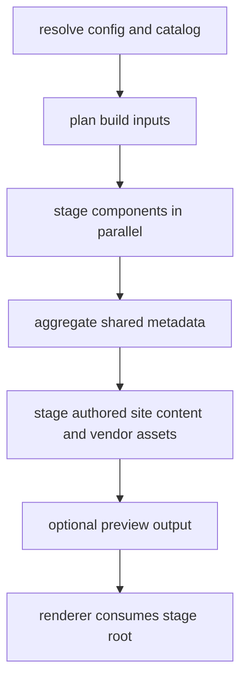
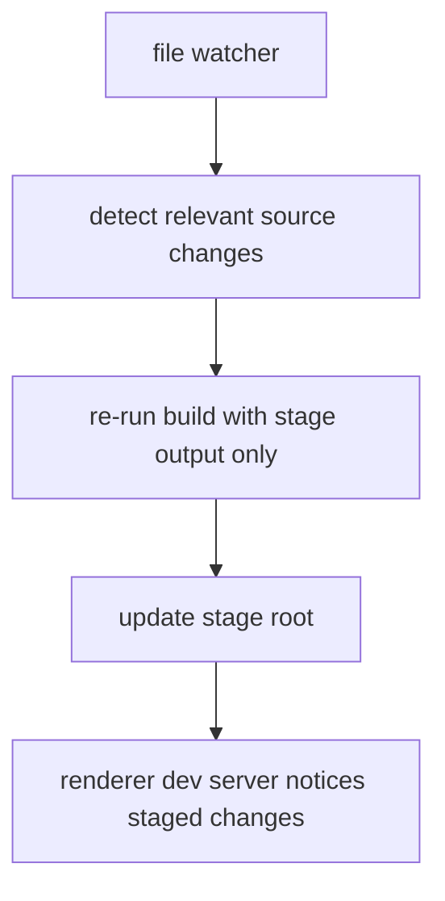

<!--
Copyright 2026 The Apache Software Foundation

Licensed under the Apache License, Version 2.0 (the "License");
you may not use this file except in compliance with the License.
You may obtain a copy of the License at

http://www.apache.org/licenses/LICENSE-2.0

Unless required by applicable law or agreed to in writing, software
distributed under the License is distributed on an "AS IS" BASIS,
WITHOUT WARRANTIES OR CONDITIONS OF ANY KIND, either express or implied.
See the License for the specific language governing permissions and
limitations under the License.
-->

# Recommended build and watch architecture

This document describes the recommended architecture for the pipeline-owned
`build()` and `stage_component()` workflows.

The recommendation is intentionally conservative:

- keep the staged tree as the only renderer-facing contract,
- keep component work isolated and idempotent,
- use process-level parallelism for component fan-out,
- keep worker internals mostly synchronous, and
- keep watch mode as an orchestration layer on top of the same build engine.

## Architectural split

The build pipeline should be separated into four layers.

1. **Resolve and plan**: resolve config, catalog, overrides, and effective inputs.
2. **Component staging**: stage one component into its owned subtree.
3. **Aggregate and finalize**: write shared metadata, authored site content, and
   optional preview output.
4. **Watch orchestration**: detect source changes and re-run the build engine.

## Recommended `build()` contract

`build()` should remain the single high-level entry point for one staging pass.
It should own only coordination and shared-output responsibilities.

Recommended responsibilities:

- resolve the effective workspace and pipeline configuration,
- load the component catalog and local overrides,
- create the immutable worker specifications for each component,
- reset or prepare pipeline-managed output roots,
- dispatch component work,
- collect `ComponentBuildResult`-like summaries,
- write aggregate metadata such as `manifest.json` and `data/*.json`,
- stage consumer-authored site content and vendor assets, and
- optionally produce lightweight preview output.

`build()` should not contain per-component business logic directly. That logic
belongs in `stage_component()` and helper functions beneath it.

## Recommended `stage_component()` contract

`stage_component()` should be the unit of isolated staging work. It should own a
single component subtree and return a compact summary of what it produced.

Recommended properties:

- deterministic for a given input snapshot,
- idempotent when re-run on the same inputs,
- no writes outside its owned component subtree,
- no dependence on mutable global state,
- small serializable input spec, and
- compact serializable result object.

Within one component worker, straightforward synchronous code is preferred for:

- metadata loading and validation,
- docs/pages/assets copying,
- Markdown and front-matter normalization,
- lifecycle normalization, and
- component-local metadata file generation.

This keeps the worker easy to reason about and makes process fan-out the main
source of parallel speedup.

## Parallelism model

For this pipeline, the recommended default is:

- **processes** for component or component-version fan-out,
- **synchronous worker internals** for local file and metadata work, and
- **threads only where profiling proves they help**, such as bounded overlap of
  clearly blocking I/O.

`asyncio` is not the recommended default here. The pipeline is dominated by
local filesystem work and synchronous parser libraries, so async I/O would add
coordination complexity without changing the core architecture.

Worker process boundaries should be narrow:

- pass paths, slugs, config values, and small metadata in,
- let the worker read its own inputs from disk,
- let the worker write its own component subtree, and
- return only a compact result summary to the parent.

Large Markdown bodies, parsed document trees, or asset blobs should not be sent
through process queues.

## Output ownership rules

The parent coordinator should own all shared outputs:

- `manifest.json`,
- aggregated `data/*.json`,
- top-level authored site content staging,
- vendor asset staging, and
- preview root generation.

Each component worker should own only its own derived paths beneath the stage
root, for example:

- `content/components/<slug>/...`, and
- `static/components/<slug>/...`.

This ownership model avoids write races and keeps failures local to one
component.

The parent coordinator should write `manifest.json` after the aggregate file
inventory is finalized so downstream consumers never see a partially declared
stage contract.

## Recommended stage-root layout

The recommended layout is:

- `manifest.json`
- `content/site/...`
- `content/components/<slug>/...`
- `static/site/...`
- `static/components/<slug>/...`
- `data/*.json`

The authoritative definition of that layout lives in
[staged-output-contract.md](staged-output-contract.md).

## One-off production build flow

The production or CI use case is a one-off staging run that prepares inputs for
renderer-driven site generation and publication.

Recommended flow:

1. resolve config and catalog,
2. stage all components,
3. write aggregate metadata,
4. stage authored site content,
5. hand the stage root to the downstream renderer,
6. let the renderer produce the final website,
7. publish outside the pipeline.

For this use case, preview output is optional convenience output rather than a
required production artifact. The important contract is the staged tree.

## Developer server flow

For local development, the primary target should also be the stage root rather
than the lightweight preview output.

Recommended local workflow:

1. run one initial stage build,
2. point the real renderer dev server at the stage root,
3. run the pipeline watcher against staged-source inputs,
4. rebuild only pipeline-managed outputs when sources change, and
5. let the renderer detect the staged changes and re-render.

The lightweight Python `preview()` server remains useful as a debugging aid when
no renderer dev server is available, but it should not be the main interactive
development story.

## Where watch mode fits

Watch mode should be a thin orchestration layer, not a separate build system.

It should:

- determine the relevant watch roots,
- filter irrelevant file changes,
- trigger the same build engine used by one-off staging, and
- restart its watch set when the effective roots change.

It should not duplicate component staging logic or invent a second metadata
pipeline.

The current safe default is full stage regeneration on each relevant change.
Over time, this can evolve toward incremental restaging, but the watch loop
should call into the same build/stage engine rather than bypassing it.

## Recommended evolution path

The safest scaling path is:

1. keep one code path for one-off build and watch-triggered rebuilds,
2. introduce coarse component-level process parallelism,
3. preserve deterministic shared-output aggregation in the parent process,
4. add incremental invalidation only after correctness is well covered, and
5. later introduce finer-grained version-level work units if released snapshot
   staging becomes expensive.

That sequence keeps the contract stable while allowing the implementation to
scale from today's full rebuild model toward larger multi-component and
multi-version workspaces.