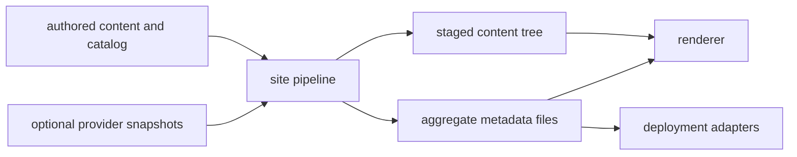
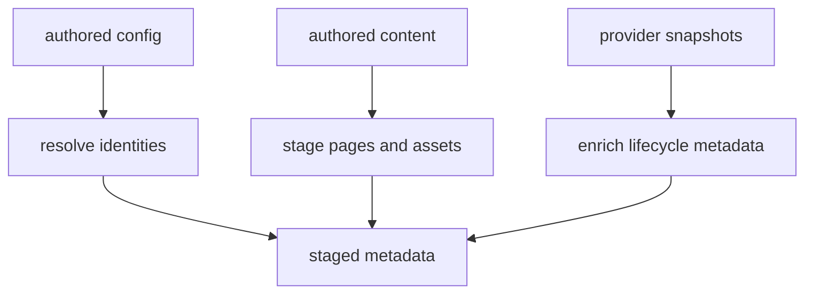
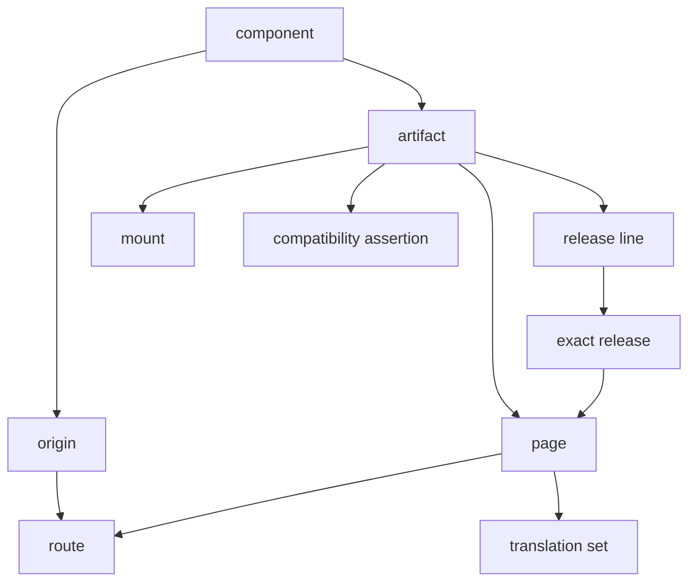

<!--
Copyright 2026 The Apache Software Foundation

Licensed under the Apache License, Version 2.0 (the "License");
you may not use this file except in compliance with the License.
You may obtain a copy of the License at

http://www.apache.org/licenses/LICENSE-2.0

Unless required by applicable law or agreed to in writing, software
distributed under the License is distributed on an "AS IS" BASIS,
WITHOUT WARRANTIES OR CONDITIONS OF ANY KIND, either express or implied.
See the License for the specific language governing permissions and
limitations under the License.
-->

The core idea is simple: the pipeline gathers authored content and metadata,
optionally enriches that with release-provider data, resolves publication and
lifecycle relationships, and emits a staged tree plus machine-readable metadata
that other tools can consume.

## What problem this architecture solves

The Site Pipeline is meant to support sites that range from very small docs trees
to large multi-artifact, multi-version, multi-locale ecosystems.

The design goal is not to make every site adopt every capability. The design goal
is to keep one mental model that scales up only when needed.

## High-level flow

The important contract is the staged output, not any particular implementation
behind it.

## Core architectural layers

1. **Authored inputs**
   - component and artifact metadata
   - docs pages, assets, and mounts
   - route, lifecycle, locale, and compatibility intent
2. **Optional provider inputs**
   - release, candidate, or ref data from systems such as ATR or other providers
3. **Pipeline resolution**
   - validates configuration
   - resolves origins, paths, routes, versions, locales, and relationships
   - emits normalized staged metadata
4. **Consumers**
   - renderers build pages from the staged tree
   - deployment adapters generate redirect or hosting config from staged metadata

## What the pipeline does

The pipeline is responsible for:

- modeling components, artifacts, release lines, exact releases, and refs
- resolving publication as `origin + path`
- preserving route semantics such as canonical routes, aliases, and redirects
- carrying locale and translation metadata when a site needs it
- carrying compatibility relationships when an ecosystem needs them
- mounting generated or imported documentation subtrees into the same
  publication model
- emitting structured support-window metadata when available
- producing renderer-facing front matter and aggregate data files

## What the pipeline explicitly does not do

The pipeline should stay disciplined about boundaries.

It does **not** define or own:

- the renderer implementation or theme layer
- a plugin architecture for every downstream site generator
- a mandatory release-provider system
- Apache `httpd`, Nginx, CDN, or static-host config syntax as core schema
- final website hosting or deployment policy
- package-manager, build-tool, or generator internals for imported docs

Instead:

- renderers consume staged content and metadata
- provider integrations remain optional inputs, not the center of the model
- deployment adapters turn server-neutral route metadata into concrete hosting
  config when needed

## Core model relationships

This is intentionally one model, not a collection of unrelated subsystems.

## Progressive complexity by site weight

The model should scale by adding dimensions only when a site needs them.

### Small sites

Usually need only:

- one component
- one origin
- a simple docs tree
- development plus released docs

### Medium sites

Often add:

- multiple artifacts
- release lines
- support status and support windows
- provider-derived release metadata

### Large sites

Often add:

- grouped components or product families
- generated/imported reference mounts
- richer route policy such as aliases and redirects
- compatibility relationships across artifacts or products

### Ecosystem-scale sites

May also add:

- locale and translation relationships
- multiple publication origins
- large redirect inventories for preserved permalinks
- deployment adapters for multiple hosting targets

The cross-check in [model-fit-cross-check.md](../model-fit-cross-check/) is the
best place to see how those pressures show up in real projects.

## Why redirect and deployment metadata are separate from content

Markdown and AsciiDoc are good places to express content and nearby page
metadata. They are poor places to express deployment policy.

That is why the pipeline should emit server-neutral route and redirect metadata,
while deployment adapters remain responsible for concrete outputs such as Apache
`httpd`, Nginx, CDN, or static-host configuration. For the practical adapter
workflow, see [../how-to/http-server-config-how-to.md](../../how-to/http-server-config-how-to/).

## Main staged outputs

The pipeline should produce:

- staged page content with page-local front matter
- aggregate metadata such as routes, redirects, content index, releases,
  translations, compatibility, and mounts
- a stable staged tree that downstream tools can treat as the integration
  boundary

## Reading guide

After this overview, the most useful next docs are usually:

- [api contract](/components/site-pipeline/development/reference/api-contract/) for the stable invocation and output
  boundaries
- [staged output contract](/components/site-pipeline/development/reference/staged-output-contract/) for the staged-tree
  layout and manifest contract
- [source-resolution-and-materialization.md](../source-resolution-and-materialization/)
  for version selection and local materialization strategy
- [validation and check](/components/site-pipeline/development/reference/validation-and-check/) for validation semantics,
  diagnostics, and `site-pipeline check`
- [build-architecture.md](../build-architecture/) for build/watch execution shape
- [security and trust model](/components/site-pipeline/development/reference/security-and-trust-model/) for trust,
  validation, and content-safety boundaries
- [flexible component publication](/components/site-pipeline/development/reference/flexible-component-publication/) for the
  main publication and lifecycle model
- [pipeline model schema reference](/components/site-pipeline/development/reference/pipeline-model-schema-reference/) for
  the typed field-level reference
- [provider snapshot schema](/components/site-pipeline/development/reference/provider-snapshot-schema/) for optional
  provider input shape
- [provider to staged metadata mapping](/components/site-pipeline/development/reference/provider-to-staged-metadata-mapping/)
  for how provider data enriches staged outputs
