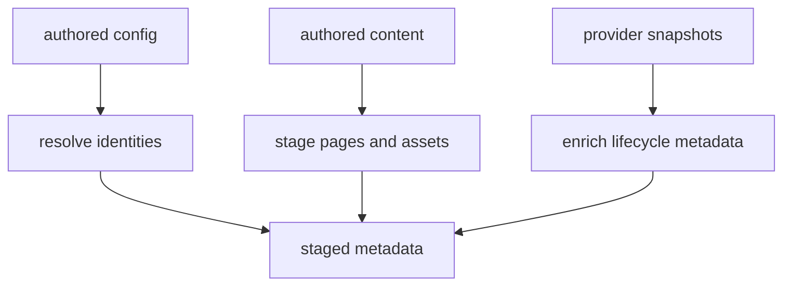
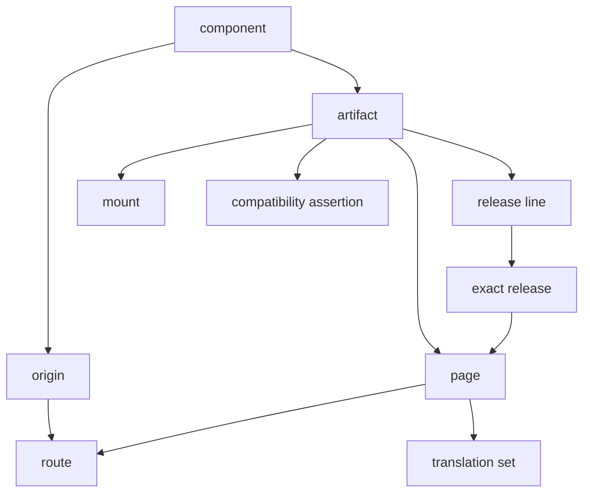

<!--
Copyright 2026 The Buildish Authors

Licensed under the Apache License, Version 2.0 (the "License");
you may not use this file except in compliance with the License.
You may obtain a copy of the License at

http://www.apache.org/licenses/LICENSE-2.0

Unless required by applicable law or agreed to in writing, software
distributed under the License is distributed on an "AS IS" BASIS,
WITHOUT WARRANTIES OR CONDITIONS OF ANY KIND, either express or implied.
See the License for the specific language governing permissions and
limitations under the License.
-->

The [Getting Started overview](../../getting-started/) introduces the
reader-facing flow from authored sources to staged output. This page explains
the deeper system boundaries and model relationships behind that flow.

## What problem this architecture solves

Site Pipeline supports sites that range from one small documentation tree to
multi-artifact, multi-version, and multi-locale ecosystems.

The design keeps one mental model and adds publication dimensions only when a
site needs them. The important integration contract is the staged output, not a
particular renderer, deployment target, or internal implementation.

## Core architectural layers

1. **Authored inputs**
   - component and artifact metadata
   - docs pages, assets, and mounts
   - route, lifecycle, locale, and compatibility intent
2. **Optional provider inputs**
   - release, candidate, or ref data from systems such as ATR or other providers
3. **Pipeline resolution**
   - validates configuration
   - resolves origins, paths, routes, versions, locales, and relationships
   - emits normalized staged metadata
4. **Consumers**
   - renderers build pages from the staged tree
   - deployment adapters generate redirect or hosting config from staged metadata

## What the pipeline does

The pipeline is responsible for:

- modeling components, artifacts, release lines, exact releases, and refs
- resolving publication as `origin + path`
- preserving route semantics such as canonical routes, aliases, and redirects
- carrying locale and translation metadata when a site needs it
- carrying compatibility relationships when an ecosystem needs them
- mounting generated or imported documentation subtrees into the same
  publication model
- emitting structured support-window metadata when available
- producing renderer-facing front matter and aggregate data files

## What the pipeline explicitly does not do

The pipeline should stay disciplined about boundaries.

It does **not** define or own:

- the renderer implementation or theme layer
- a plugin architecture for every downstream site generator
- a mandatory release-provider system
- Apache `httpd`, Nginx, CDN, or static-host config syntax as core schema
- final website hosting or deployment policy
- package-manager, build-tool, or generator internals for imported docs

Instead:

- renderers consume staged content and metadata
- provider integrations remain optional inputs, not the center of the model
- deployment adapters turn server-neutral route metadata into concrete hosting
  config when needed

## Core model relationships

This is intentionally one model, not a collection of unrelated subsystems.

## How the model scales

The model adds artifacts, release lines, provider enrichment, grouped
components, compatibility, localization, and multiple origins only when the
publication shape needs them. Use the
[Getting Started adoption paths](../../getting-started/) to select a practical
entry point. The [model-fit cross-check](../model-fit-cross-check/) explains the
evidence and rationale behind those size bands.

## Why redirect and deployment metadata are separate from content

Markdown and AsciiDoc are good places to express content and nearby page
metadata. They are poor places to express deployment policy.

That is why the pipeline should emit server-neutral route and redirect metadata,
while deployment adapters remain responsible for concrete outputs such as Apache
`httpd`, Nginx, CDN, or static-host configuration. For the practical adapter
workflow, see
[HTTP server configuration from staged metadata](../../how-to/http-server-config-how-to/).

## Main staged outputs

The pipeline should produce:

- staged page content with page-local front matter
- aggregate metadata such as routes, redirects, content index, releases,
  translations, compatibility, and mounts
- a stable staged tree that downstream tools can treat as the integration
  boundary

## Reading guide

For unreleased development contract details, continue with:

- [API contract](../../development/reference/api-contract/) for the stable
  invocation and output boundaries
- [staged output contract](../../development/reference/staged-output-contract/)
  for the staged-tree layout and manifest contract
- [validation and check](../../development/reference/validation-and-check/) for
  validation semantics, diagnostics, and `site-pipeline check`
- [security and trust model](../../development/reference/security-and-trust-model/)
  for trust, validation, and content-safety boundaries
- [flexible component publication](../../development/reference/flexible-component-publication/)
  for the main publication and lifecycle model
- [pipeline model schema reference](../../development/reference/pipeline-model-schema-reference/)
  for the typed field-level reference
- [provider snapshot schema](../../development/reference/provider-snapshot-schema/) for optional
  provider input shape
- [provider to staged metadata mapping](../../development/reference/provider-to-staged-metadata-mapping/)
  for how provider data enriches staged outputs

For deeper architecture topics, continue with:

- [source resolution and materialization](../source-resolution-and-materialization/)
  for version selection and local materialization strategy
- [build architecture](../build-architecture/) for build/watch execution shape
- [provider end-to-end example](../provider-e2e-example/) for a concrete flow
  across the authored, provider, and emitted boundaries
