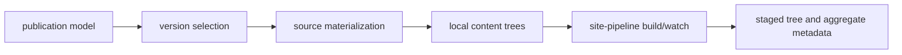
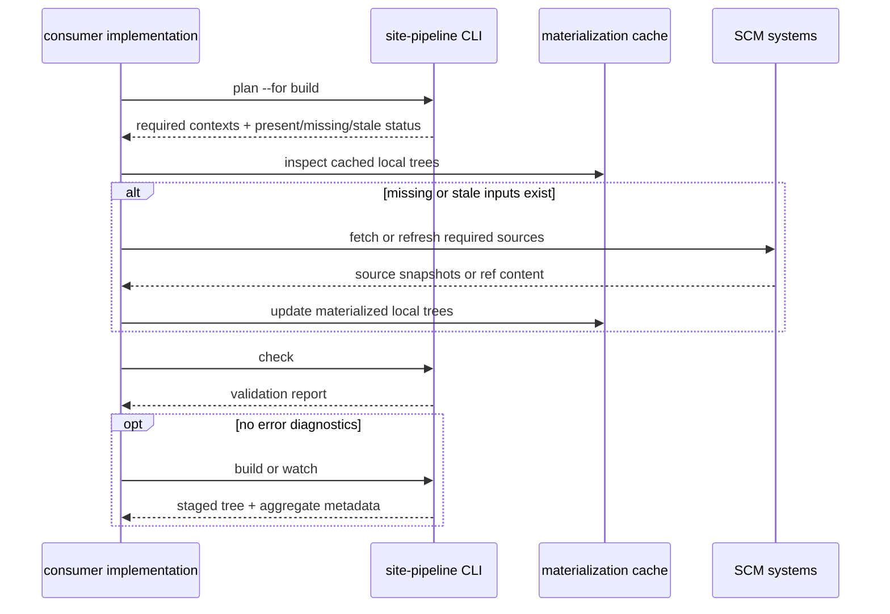

<!--
Copyright 2026 The Apache Software Foundation

Licensed under the Apache License, Version 2.0 (the "License");
you may not use this file except in compliance with the License.
You may obtain a copy of the License at

http://www.apache.org/licenses/LICENSE-2.0

Unless required by applicable law or agreed to in writing, software
distributed under the License is distributed on an "AS IS" BASIS,
WITHOUT WARRANTIES OR CONDITIONS OF ANY KIND, either express or implied.
See the License for the specific language governing permissions and
limitations under the License.
-->

# Source resolution and materialization

For maintainer-facing notes about planning-layer ownership, effective input
resolution, watch-root derivation, and shared execution boundaries, see
[`../maintenance/code-maintenance.md`](../maintenance/code-maintenance.md).

This document separates three concerns that are easy to mix together when
discussing versioned documentation:

1. **version selection**: which documentation contexts should exist
2. **source materialization**: how those contexts become local input trees
3. **staging**: how local input trees are copied and normalized into the staged
   output contract

## Refs, tags, and line heads are valid source identities

The model supports the core versioned-docs identities:

- development docs may come from a moving development ref
- release-line docs may come from maintenance refs or line heads
- exact release docs may come from immutable tags

That is already reflected in the publication model and schema through concepts
such as `source`, `developmentRef`, `maintenanceRefPattern`, `tagPattern`, and
release-line metadata.

## Consumers should integrate against materialized inputs, not Git itself

The core build contract should not require downstream consumers to think in
terms of raw `git clone` mechanics.

Instead, the important boundary is that `build` and `watch` consume **resolved
local content inputs**.

Those local inputs may come from several strategies, for example:

- direct branch or tag checkouts
- shallow clones or sparse checkouts
- a cache branch such as `versioned-docs`
- immutable exported snapshots or tarballs
- generated local worktrees assembled by consumer-specific tooling

Git is an important implementation strategy, but it should not be the only shape
the architecture can describe.

## A `versioned-docs` branch is a cache strategy, not a publication concept

For projects with very large release histories, re-materializing every
historical tag on every build does not scale well.

A `versioned-docs` branch is a valid optimization for that problem.

Architecturally, it should be treated as:

- a cache or materialization strategy,
- optional,
- replaceable by other strategies later, and
- independent from publication identity and URL structure.

It should **not** be treated as:

- the source of truth for release identity,
- a required lifecycle concept in the publication model, or
- something renderers need to know about.

The publication model talks about development refs, release lines, and
exact releases. A cache branch is simply one way to materialize the content for
those identities efficiently.

## Recommended architectural split

The clean split is:

1. the **publication model** declares what kinds of versioned documentation exist
2. a **selection step** decides which of those contexts are in scope for a build
3. a **materializer** obtains local trees for the selected contexts
4. `site-pipeline build/watch` stages those local trees without owning the SCM
   strategy

This keeps version/lifecycle modeling separate from Git-specific optimization.

## How a consumer should know what to materialize

The consumer should not need to guess from repository state alone.

Instead, there should be a planning step that resolves a desired build scope,
for example:

- current development docs
- one or more maintenance-line heads
- exact releases selected by policy
- explicit preview refs when a site exposes them

That planning step should be driven by the resolved `publicationSelection`
policy for each artifact.

Policy resolution should be:

1. artifact `publicationSelection`, if present
2. component default `publicationSelection`, if present
3. built-in default selection behavior

The built-in default should be:

- include development docs
- include all authored line heads
- include the latest stable release per release line
- include only explicitly selected authored named refs
- exclude release candidates unless explicitly requested

The planning step therefore depends on:

- authored component and artifact config
- release-line metadata
- authored exact-release publication state
- provider snapshots

Provider snapshots may enrich discovered versions and ref state, but they should
not replace the authored selection policy that defines what the site intends to
publish.

The result should be a resolved list of local inputs to stage.

That local-input universe should match what `build` and `watch` actually
consume: consumer-owned top-level site pages, site assets, and vendor asset
trees as well as component/version-context trees.

In practical terms, that planning step is a report-only CLI interaction. Its job
is to say which version contexts are required, which local inputs are already
present, and which pieces are missing or stale. It does not itself perform
network fetches or cache mutation.

The stable command for that interaction should be `site-pipeline plan`.
Automation should be able to request a specific report schema version
explicitly. JSON report output without an explicit requested schema version is an
invalid invocation. Unsupported requested versions should fail fast.

## Recommended interaction model

The clean interaction model is that the consumer implementation asks
`site-pipeline` what is needed, then uses SCM and cache-specific machinery to
materialize any missing inputs before invoking `check`, `build`, or `watch`.

In that model, `site-pipeline` remains responsible for planning and staging,
while the consumer implementation remains responsible for acquisition strategy.
That keeps the core pipeline compatible with direct checkouts, cache branches
such as `versioned-docs`, snapshot stores, or other future materialization
mechanisms without turning `build` into an SCM orchestration command.

## Resolved materialization report

The machine-readable planning result is a JSON `ResolvedMaterializationReport`.
It can be emitted to stdout or written to a caller-selected path.

The recommended CLI shape is:

- `site-pipeline plan --for build`
- `site-pipeline plan --for watch`
- `site-pipeline plan --for build --report-format json --report-schema-version 1`
- `site-pipeline plan --for build --report-format json --report-schema-version 1 --report-output -`
- `site-pipeline plan --for build --report-format json --report-schema-version 1 --report-output .site-pipeline/materialization-report.json`

Recommended flag meanings are:

- `--for` accepts `build` or `watch` and selects the planning target
- `--report-format` accepts `text` or `json`; default is `text`
- `--report-schema-version` selects the requested report `schemaVersion` and is
  required when `--report-format json` is selected
- `--report-output` selects the report destination; `-` means stdout and is the
  default

For automation, callers should request the desired report `schemaVersion`
explicitly. Successful planning should still return a report when inputs are
missing or stale; those states belong in the payload rather than in ad hoc exit
codes.
The report header should identify the requested planning `target` rather than
repeat the literal `plan` command name.

Recommended planning exit codes are:

- `0`: planning completed and produced a report, even if some entries are
  `missing`, `stale`, or `unresolved`
- `1`: planning completed but found error diagnostics that prevent a usable plan
- `2`: invalid invocation, invalid option combination, or unsupported requested
  report schema version
- `3`: internal failure while attempting to evaluate the workspace

Recommended entry fields include:

- `sourceKey`
- `inputKind` such as `sitePages`, `siteAssets`, `vendorAssets`,
  `development`, `lineHead`, `released`, or `namedRef`
- optional `componentSlug`
- optional `artifactKey`
- optional `releaseLine`
- optional `version`
- optional `ref`
- optional `tag`
- optional `commitSha`
- `expectedLocalPath`
- `status` such as `present`, `missing`, `stale`, or `unresolved`
- `provenance` such as `gitCheckout`, `cacheBranch`, `snapshot`, `workspace`,
  or `generated`
- optional `watchEligible` for `plan --for build`; required for every entry in
  `plan --for watch`
- optional `reason`, for example `pathMissing`, `staleIdentityMismatch`,
  `invalidMarker`, `expectedDirectory`, or `pathOutsideDeclaredRoot`

For planning targeted at `watch`, every entry should carry an explicit
`watchEligible` value. Mutable workspace-backed inputs should
normally be marked `watchEligible: true`. That usually includes top-level site
pages, top-level site assets, and other actively edited local content trees.
Inputs backed by immutable snapshots, cached historical releases, or other
non-live materializations should normally be `watchEligible: false`.
`vendorAssets` may fall into either category depending on whether they come from
mutable workspace paths or immutable generated/imported trees.

That report lets the build engine say:

- these are the local inputs to stage,
- here is where each local tree lives, and
- here is how each one was materialized.

## Planning versus `check`

The planning report and `site-pipeline check` solve related but different
problems.

- planning says what local inputs are required and whether they are present,
  missing, stale, or unresolved
- `check` says whether the current workspace and currently available inputs are
  valid and ready for staging

In practice, `check` should reuse planning information when local inputs are
missing, but it should surface that state as validation diagnostics rather than
as a materialization inventory.

## What `build` and `watch` should assume

The stable `build` and `watch` commands should assume that the required local
inputs already exist and have either passed `check` or are represented by a
resolved materialization report and equivalent in-memory validation state.

Those required local inputs include consumer-owned top-level site pages, site
assets, and vendor asset trees in addition to component/version-context trees.

In particular:

- `build` should stage from local resolved inputs
- `build` should not require a full clone of every historical tag
- `watch` should focus mainly on mutable inputs such as development refs and
  local authored content
- `watch` should derive its watch roots from planning entries marked
  `watchEligible: true`
- immutable historical release snapshots should usually be treated as cached
  inputs rather than watch targets

This keeps `watch` fast and avoids turning it into a generalized SCM sync loop.

## What stays out of the core pipeline contract

The core pipeline should not hard-code:

- how Git fetches are performed
- whether worktrees, clones, or archives are used
- a special status for a branch literally named `versioned-docs`
- network sync policy for historical snapshots
- renderer-visible behavior based on SCM layout details

Those choices belong in consumer-specific tooling or a future dedicated
materialization helper layer.

## Practical interpretation

For a small site, source materialization may be as simple as reading the current
workspace checkout.

For a large site, it may mean:

- reading development docs from a working branch,
- reading maintenance docs from a few moving refs,
- reading historical release docs from a `versioned-docs` cache branch or other
  immutable snapshot store, and
- handing all of those local paths to `site-pipeline build`.

Both cases fit the same architecture.

## Read next

- [architecture-overview.md](architecture-overview.md) for the top-level system
  model
- [api contract](/docs/reference/api-contract/) for stable invocation and output boundaries
- [staged output contract](/docs/reference/staged-output-contract/) for the staged-tree
  contract consumed by renderers and deployment adapters
- [../maintenance/code-maintenance.md](../maintenance/code-maintenance.md) for maintainer-facing planning and
  execution-path boundaries
- [build-architecture.md](build-architecture.md) for the build/watch execution
  model
- [flexible component publication](/docs/reference/flexible-component-publication/) for the
  publication and lifecycle model