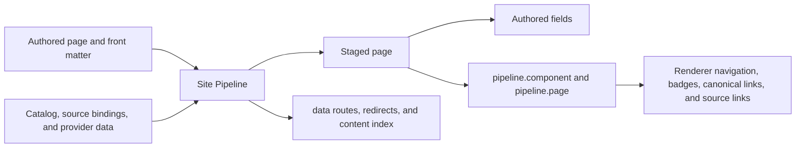

<!--
Copyright 2026 The Buildish Authors

Licensed under the Apache License, Version 2.0 (the "License");
you may not use this file except in compliance with the License.
You may obtain a copy of the License at

http://www.apache.org/licenses/LICENSE-2.0

Unless required by applicable law or agreed to in writing, software
distributed under the License is distributed on an "AS IS" BASIS,
WITHOUT WARRANTIES OR CONDITIONS OF ANY KIND, either express or implied.
See the License for the specific language governing permissions and
limitations under the License.
-->

An authored page normally knows about its content, but not the complete site in
which it will be published. Its `title`, `description`, navigation weight, and
other renderer-specific fields belong to the author. Public paths, release
context, translations, and repository links often depend on the catalog and the
particular pipeline run.

Site Pipeline joins those two kinds of information during staging. It preserves
the authored fields and injects normalized metadata below the reserved
top-level `pipeline` key.



## Two owners in one staged document

Top-level fields outside `pipeline` remain authored metadata. Site Pipeline
does not ask authors to replace familiar renderer fields such as `title` or
`weight` with pipeline-specific equivalents.

The `pipeline` namespace is different: it is owned by Site Pipeline and exists
only in staged output. An authored page that already defines `pipeline` is
rejected because merging two owners into the same namespace would be
ambiguous. Do not copy injected values back into source pages or edit them in
`.stage`; the next build derives them again.

This staged front-matter excerpt shows both owners together:

<!-- test:enhanced-front-matter -->
```yaml
title: Install the runtime
description: Get a local runtime running in five minutes.
weight: 20
pipeline:
  page:
    kind: release-page
    section: released
    artifactKey: runtime
    path: /spark/releases/4.0.0/getting-started/
    url: https://docs.example.org/spark/releases/4.0.0/getting-started/
    canonicalUrl: https://docs.example.org/spark/releases/4.0.0/getting-started/
    componentPath: /spark/
    componentUrl: https://docs.example.org/spark/
    version:
      kind: released
      label: 4.0.0
      tag: v4.0.0
    provider:
      key: github
      externalId: release-4.0.0
    source:
      key: runtime
      path: docs/releases/4.0.0/getting-started.md
      repository: https://github.com/example/runtime
      viewRef: main
      editRef: main
```

Fields are omitted when they do not apply. A local-only source, for example,
can have `source.key` and `source.path` without a repository or refs.

## What the injected metadata adds

`pipeline.component` describes component-wide context useful across many
pages. Depending on the component, it can include:

- stable identity and display name
- the latest stable version
- resolved component, development, documentation, and asset publication roots
- compact artifact and release-line summaries

`pipeline.page` describes the current staged page. It can include:

- page kind, section, artifact, public path, URL, canonical URL, and alternates
- locale, translation identity, and links to translated siblings
- a title or description derived from the body when the pipeline can detect one
- version, release-line, maturity, support, and publication context
- provenance for the provider record used during planning
- provenance for the authored source file

Renderers can therefore select layouts by `kind`, build version selectors from
normalized version data, emit canonical and alternate links, add language
switchers, or display lifecycle badges without parsing repository layout or
querying a release provider.

## Source provenance and useful repository links

`pipeline.page.source` identifies the source binding and a path relative to
that binding's root. It never points into `site/.stage`:

- `key` identifies the named source binding
- `path` is repository-relative within that source binding
- `repository` is present when the binding declares a remote repository
- `viewRef` and `editRef` come from the binding's declared default branch

A GitHub-aware renderer could combine those values into `blob` and `edit` URLs;
another renderer could apply GitLab, Forgejo, or a company-specific URL shape.
The pipeline deliberately emits structured provenance instead of a
provider-specific URL. Consumers must URL-encode path and ref segments and
should omit a link when the required repository or ref is absent.

When a source declares `repository`, its binding root must correspond to that
repository's root because the current contract has no separate repository-path
prefix. A source binding rooted in one subdirectory of a larger repository can
still be used locally, but it must be moved to the repository root (with
explicit metadata and content paths) before its provenance can produce correct
repository links.

The same `source` object appears in `data/content-index.json`, so a theme can
render a page-local link while search, audit, or documentation tooling can use
the aggregate inventory.

## Where to look next

- [Staged output and consumers](../staged-output-and-consumers/) explains the
  complete hand-off to renderers and deployment tools.
- [Inspect staged output and routes](../../how-to/inspect-staged-output-and-routes/)
  walks through a built stage.
- [Unreleased development front-matter reference](../../development/reference/pipeline-staged-front-matter-reference/)
  lists every typed field.
