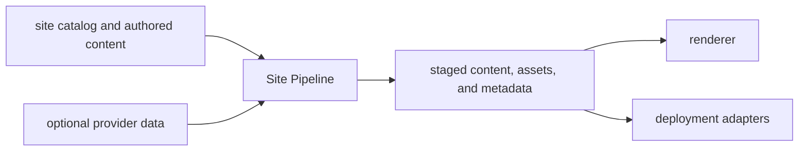

<!--
Copyright 2026 The Buildish Authors

Licensed under the Apache License, Version 2.0 (the "License");
you may not use this file except in compliance with the License.
You may obtain a copy of the License at

http://www.apache.org/licenses/LICENSE-2.0

Unless required by applicable law or agreed to in writing, software
distributed under the License is distributed on an "AS IS" BASIS,
WITHOUT WARRANTIES OR CONDITIONS OF ANY KIND, either express or implied.
See the License for the specific language governing permissions and
limitations under the License.
-->

Documentation sites often need to combine content from several repositories,
preserve public routes across releases, and give renderers consistent metadata.
Doing that independently in every renderer or component repository makes
publication behavior difficult to validate and easy to duplicate.

Site Pipeline puts that work behind one staging contract. It reads the
consumer-owned catalog and authored content, optionally adds provider data,
validates and resolves publication intent, and emits normalized content, assets,
and metadata for downstream consumers.

The renderer still owns presentation, navigation, and theme behavior. Hosting
and deployment adapters still own platform-specific configuration. Site
Pipeline gives those consumers a stable, validated hand-off instead of asking
them to reconstruct publication policy from repository layout.

## Reach a first successful stage

For the smallest complete workflow:

1. [Create a tiny site](../how-to/create-a-tiny-site/) with one catalog and one
   authored page.
2. Run `site-pipeline check` and `site-pipeline build`.
3. [Inspect the staged output and routes](../how-to/inspect-staged-output-and-routes/)
   to see the contract that a renderer consumes.

The [tiny-site concept](../concepts/tiny-site-shape/) explains the same example
as a repository shape before you copy it.

## Choose your adoption path

Choose the size band that matches your publication complexity today. It is not
a measure of traffic, team size, or content volume. Each page gives the smallest
useful model for that shape, calls out what can wait, and links to the next band
when the publication model grows.

| Size band | Good fit if your site looks like this | Start here |
| --- | --- | --- |
| tiny | one component, one main docs tree, minimal lifecycle surface | [Tiny sites](tiny/) |
| small | one main product, a few versions, maybe one mounted API or reference subtree | [Small sites](small/) |
| medium | one product family with multiple doc surfaces, generated or imported docs, and publication planning needs | [Medium sites](medium/) |
| large | one platform plus many modules, extensions, or sibling projects with stronger routing and compatibility needs | [Large sites](large/) |
| very-large | many repos or doc sources, multiple product families, localization, and strong permalink continuity requirements | [Very-large sites](very-large/) |

## If you are not sure where to start

- start with [Tiny sites](tiny/) if you have one component and no serious version
  or publication policy yet
- start with [Small sites](small/) if you already need latest-release/development
  routes or simple redirects
- start with [Medium sites](medium/) if the site already has multiple artifacts,
  imported docs, or a planning/materialization step

## Shared follow-on trails

- [Concepts](../concepts/) for the plain-language model and concrete example
  thread used across the docs.
- [How-to guides](../how-to/) for task-oriented procedures.
- [Architecture and design](../architecture/) for system shape, rationale, and
  examples.
- [Unreleased development reference](../development/reference/) for contracts,
  schemas, and trust-model details that have not yet been published as a
  release.
- [Model-fit cross-check](../architecture/model-fit-cross-check/) for the
  rationale behind the size bands.
